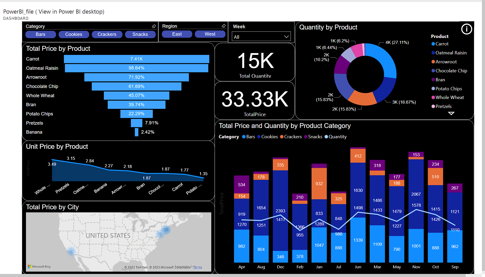
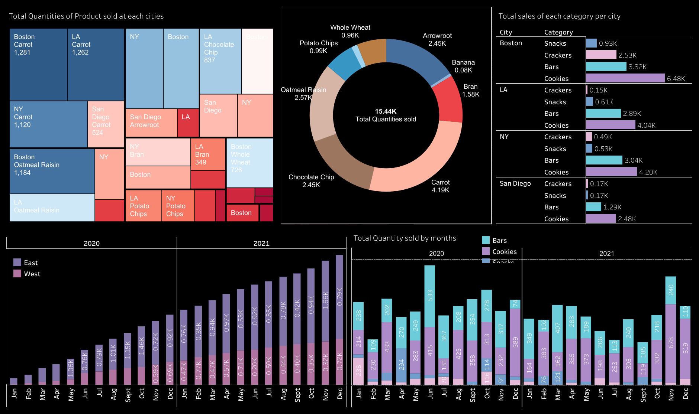
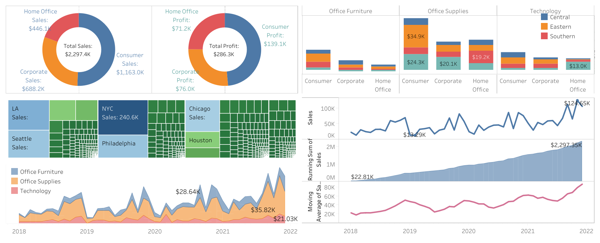

The link to my Tableau Public dashboards: https://public.tableau.com/app/profile/pallavmarch

# Power BI and Tableau Project Files

## Description
This repository is a comprehensive collection of data visualization projects created using Power BI and Tableau. It includes project files, images of dashboards, and a demonstration video. These resources are designed to help you understand and replicate advanced data visualization techniques and best practices.

## Screenshots
### Power BI Projects
#### Project 1
](https://github.com/pallavmarch/Power-BI-Tableau-dashboards/blob/main/Power%20BI_dashboard_0.png))

### Tableau Dashboards
#### Dashboard 1
](https://github.com/pallavmarch/Power-BI-and-Tableau-Project-Files/blob/main/Dashboard%201.png)
#### Dashboard 2
](https://github.com/pallavmarch/Power-BI-and-Tableau-Project-Files/blob/main/The%20Dashboard.png)

](https://github.com/pallavmarch/Power-BI-and-Tableau-Project-Files/blob/main/Image_Tableau_Dashboard_1.png)

## Usage
### Power BI
1. Open the `.pbix` files using Power BI Desktop.
2. Explore the visualizations and the underlying data models.

### Tableau
1. Open the `.twbx` files using Tableau Desktop.
2. Examine the dashboards and worksheets to understand the data insights.
