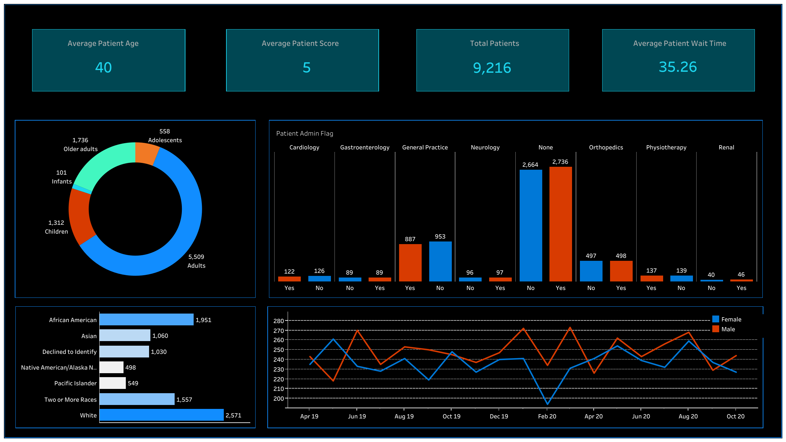

The link to my Tableau Public dashboards: https://public.tableau.com/app/profile/pallavmarch

# Power BI and Tableau Project Files

## Description
This repository is a comprehensive collection of data visualization projects created using Power BI and Tableau. It includes project files, images of dashboards, and a demonstration video. These resources are designed to help you understand and replicate advanced data visualization techniques and best practices.

## Contents
- **Power BI Projects**
  - `Power_BI_Project_1.pbix` (Compressed in `Power_BI_Project_1_pbix_file.rar`)
  - `Power_BI_Project_2.pbix` (Compressed in `Power_BI_Project_2_pbix_file.rar`)
- **Tableau Projects**
  - `Book3.twbx`
  - `Hospital_data.twbx`
  - `Points_tabl.twbx`
  - `Project-1.twbx`
- **Images**
  - `Image_Power_BI_Project_1.png`
  - `Image_Power_BI_Project_2.png`
  - `Image_Tableau_Dashboard_1.png`
  - `Image_Tableau_Dashboard_2.png`
  - `Image_Tableau_Dashboard_3.png`
  - `Image_Tableau_Dashboard_4.png`
- **Video**
  - `power_bi_video.mp4`

## Usage
### Power BI
1. Extract the `.pbix` files from the `.rar` archives.
2. Open the `.pbix` files using Power BI Desktop.
3. Explore the visualizations and the underlying data models.

### Tableau
1. Open the `.twbx` files using Tableau Desktop.
2. Examine the dashboards and worksheets to understand the data insights.

## Screenshots
### Power BI Projects
#### Project 1

#### Project 2

### Tableau Dashboards
#### Dashboard 1

#### Dashboard 2

#### Dashboard 3

#### Dashboard 4

## Demo Video
A video demonstrating the Power BI projects:
[Power BI Demo Video](power_bi_video.mp4)
